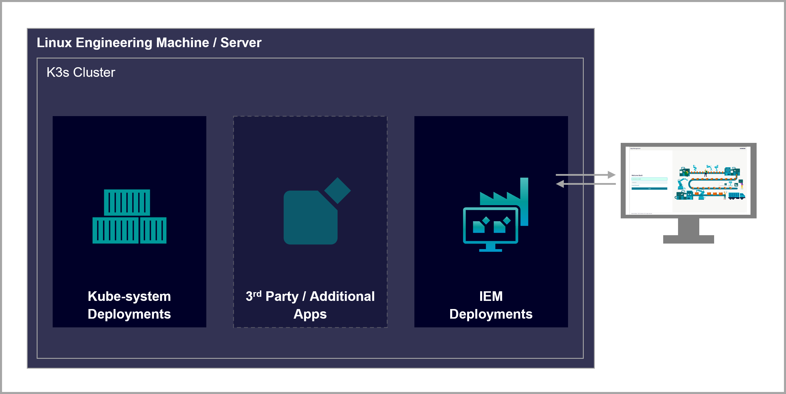

# Industrial Edge Management on K3s 

Industrial Edge can be installed on any Kubernetes (K8s) cluster.  
This documentation describes the complete installation process of IEM 2.0 on K3s distribution.

- [Industrial Edge Management on K3s](#industrial-edge-management-on-k3s)
  - [Description](#description)
    - [Overview](#overview)
    - [General Task](#general-task)
  - [Requirements](#requirements)
    - [Prerequisites](#prerequisites)
    - [Network Requirements](#network-requirements)
    - [Used components](#used-components)
  - [Installation](#installation)
  - [Usage](#usage)
  - [Documentation](#documentation)
  - [Contribution](#contribution)
  - [License and Legal Information](#license-and-legal-information)
  - [Disclaimer](#disclaimer)
    
## Description

### Overview
Industrial Edge Management deployed in K3s cluster.

### General Task
The objective of this tutorial is to provide a comprehensive walkthrough for users on the setup process of IEM 2.0 on a Kubernetes cluster. To achieve this, a new Kubernetes cluster will be established utilizing the K3s framework, and subsequently, the IEM service will be deployed within it. By the conclusion of this tutorial, users will have successfully created and onboarded a new IEM instance, which will be fully prepared for utilization within the Industrial Edge Ecosystem.


*General architecture overview*
## Requirements
### Prerequisites
* Industrial Edge Hub (IEH) Access
* Powerful host PC/server with Internet access  
  With minimum of:
    * 4 (v)CPU cores
    * 16 GB Ram
    * 100GB HDD Space
* Linux based operating system

### Network Requirements
To ensure the successful onboarding of a new Industrial Edge Management (IEM) instance, it is imperative that the host machine possesses an active internet connection and the capability to access IE Hub domains. If your host machine operates within a proxy or firewall environment, it is essential to ensure that all necessary domains are appropriately whitelisted. Please refer to the "[Industrial Edge - Security Overview](https://support.industry.siemens.com/cs/us/en/view/109814450)" document for further guidance.
### Used components
* K3s - Kubernetes distribution - v1.27.3+k3s1
* IEM - Industrial Edge Management - v1.2.24
* ieprovision - Industrial Edge Provisioning CLI - Ubuntu - v1.0.8

## Installation
To deploy Industrial Edge Management on a K3s cluster, you must perform the following tasks:
* [Install K3s Cluster](/docs/Installation.md)
* [Create an IEM instance in the Industrial Edge Hub (IEH)](/docs/Deployment.md#create-an-iem-instance-in-the-industrial-edge-hub)
* [Download and install the IE Provisioning CLI](/docs/Deployment.md#download-nad-install-the-ie-provisioning-cli)
* [Install the IEM on the K3s Cluster](/docs/Deployment.md#install-the-iem)


<!-- [Build application](docs/Installation.md#build-application) -->

## Usage

When the app is installed, how can I use it? Usually some basic UI description to prove that the app is working correctly.

## Documentation
You can find further documentation and help in the following links

* [Industrial Edge Hub](https://iehub.eu1.edge.siemens.cloud/#/documentation)
* [Industrial Edge Forum](https://www.siemens.com/industrial-edge-forum)
* [Industrial Edge landing page](https://new.siemens.com/global/en/products/automation/topic-areas/industrial-edge/simatic-edge.html)
* [Industrial Edge GitHub page](https://github.com/industrial-edge)

## Contribution

Thank you for your interest in contributing. Anybody is free to report bugs, unclear documentation, and other problems regarding this repository in the Issues section.
Additionally everybody is free to propose any changes to this repository using Pull Requests.

If you are interested in contributing via Pull Request, please check the [Contribution License Agreement](Siemens_CLA_1.1.pdf) and forward a signed copy to [industrialedge.industry@siemens.com](mailto:industrialedge.industry@siemens.com?subject=CLA%20Agreement%20Industrial-Edge).

## License and Legal Information

Please read the [Legal information](LICENSE.txt).
## Disclaimer

```
Please add this Disclaimer in case your repository contains a Dockerfile otherwise you can remove the whole section
```

IMPORTANT - PLEASE READ CAREFULLY:

This documentation describes how you can download and set up containers which consist of or contain third-party software. By following this documentation you agree that using such third-party software is done at your own discretion and risk. No advice or information, whether oral or written, obtained by you from us or from this documentation shall create any warranty for the third-party software. Additionally, by following these descriptions or using the contents of this documentation, you agree that you are responsible for complying with all third party licenses applicable to such third-party software. All product names, logos, and brands are property of their respective owners. All third-party company, product and service names used in this documentation are for identification purposes only. Use of these names, logos, and brands does not imply endorsement.
